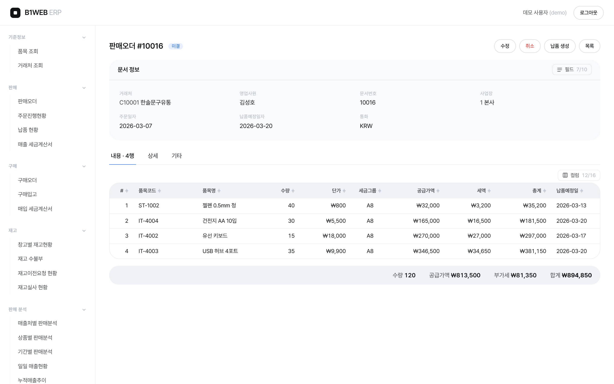
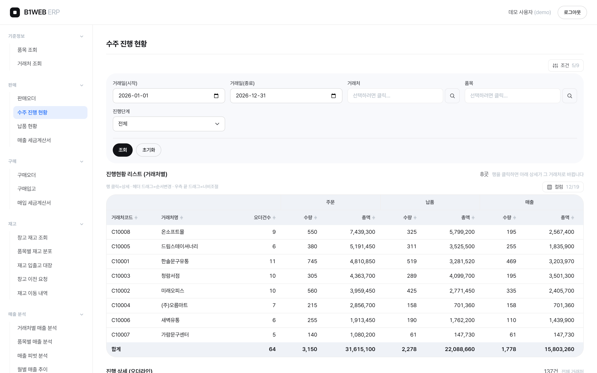
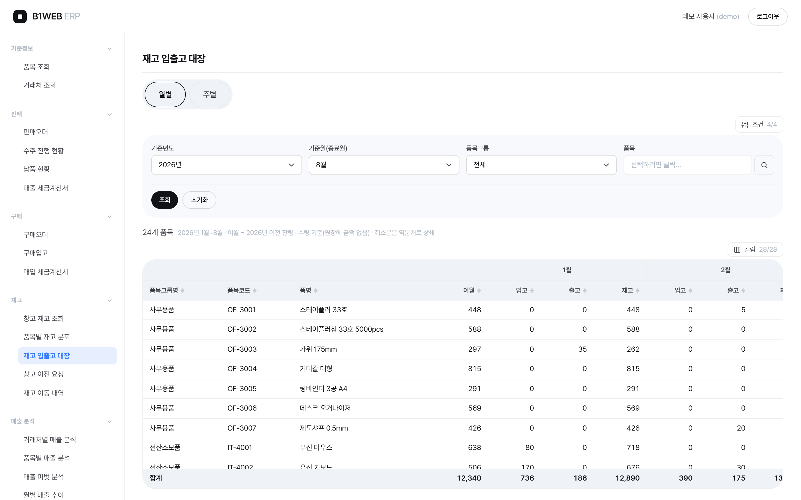
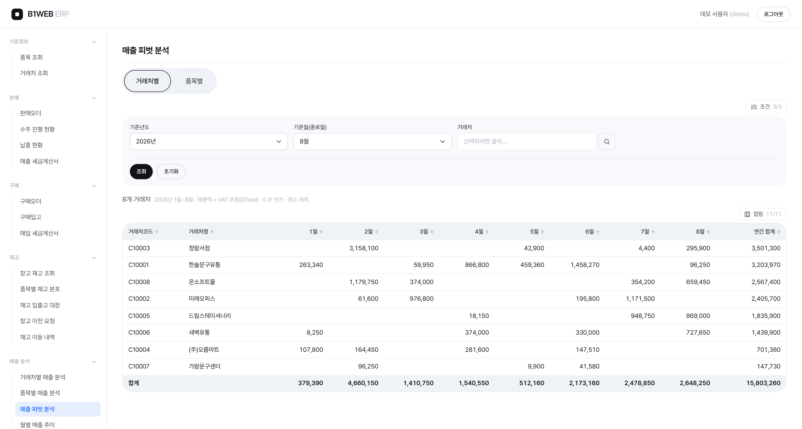
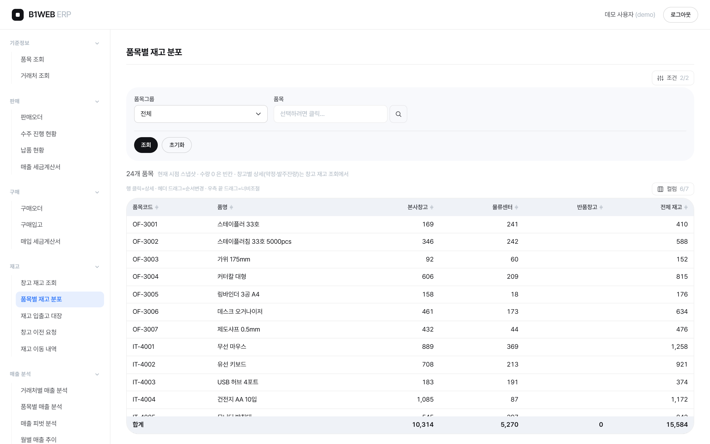
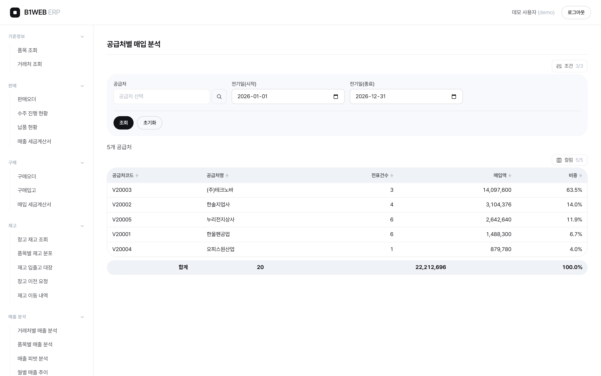
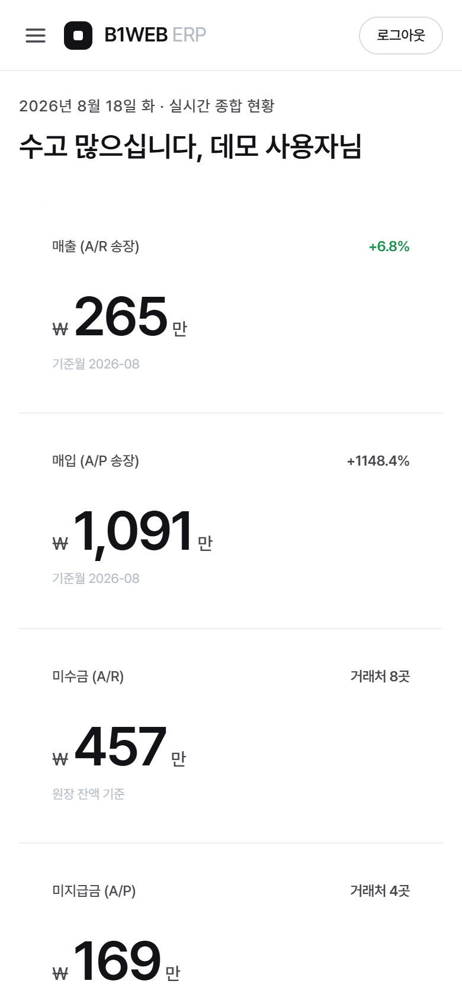
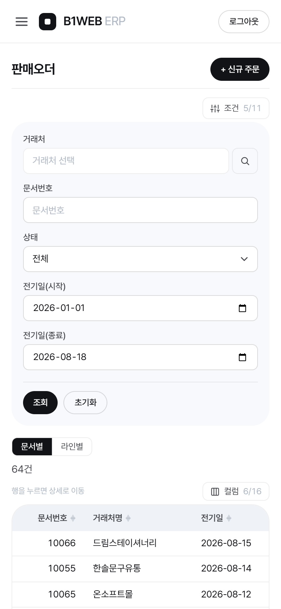
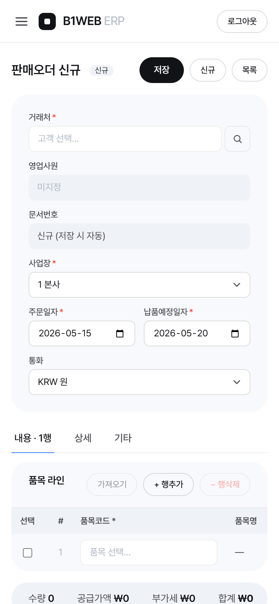
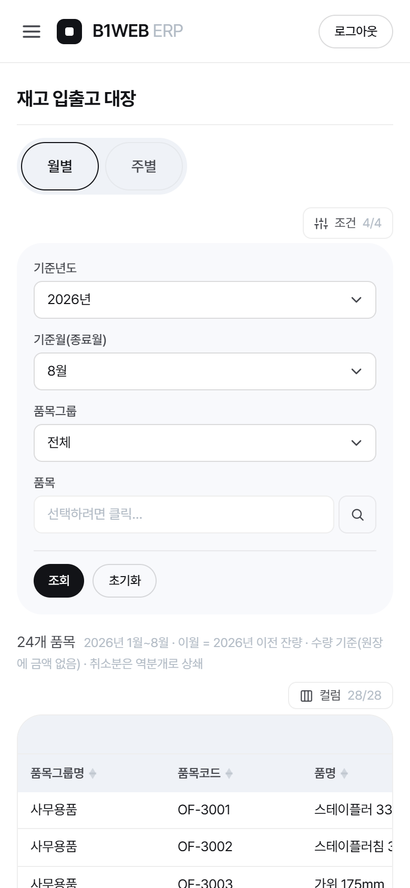

# B1WEB-Next — 브라우저로 쓰는 SCM/ERP (SAP B1 데이터 모델 기반)

> ERP 클라이언트를 설치하기 어려운 현장·원격 사용자가 **브라우저만으로** 판매·구매·재고 업무를
> 처리할 수 있을까 — 를 검증해 본 사이드 프로젝트입니다. SAP Business One 의 데이터 모델
> (표준 테이블·문서연결 규칙)을 그대로 따라, 판매·구매 문서흐름(오더 → 납품/입고 → 송장),
> 재고, 마스터, 분석 리포트까지 **ERP 핵심 도메인이 실제로 동작하는 형태**로 구현했습니다.
>
> **모든 데이터는 가상입니다.** 회사·거래처·품목·인물 어느 것도 실존하지 않으며,
> 실서버 접속 정보는 포함되어 있지 않습니다.

## 라이브 데모

### 👉 https://b1web-next.vercel.app

로그인 화면의 **[데모 계정으로 둘러보기]** 버튼이면 바로 들어갑니다 (직접 입력 시 `demo` / `demo1234`).

[](https://b1web-next.vercel.app)

> **만든 문서는 실제로 남습니다.** 배포본은 공유 DB(libSQL/Turso)를 보므로 오더를 만들고
> 납품·송장으로 이어가는 흐름을 그대로 시연할 수 있습니다. 다만 방문자가 모두 같은 데이터를
> 보기 때문에, 매일 03:00(KST) 가상 데이터를 원상복구합니다 — 만들어 보셔도 됩니다.

## 실행

```bash
npm install
npm run dev        # http://localhost:3000
```

외부 DB·환경변수·계정 설정이 필요 없습니다. 첫 실행 때 SQLite 데모 DB(`.data/b1web.db`)가
자동 생성되고, 가상 ERP 데이터(문서 200여 건 + 마스터)가 시드됩니다. 로그인은 위 데모 계정과 같습니다.

```bash
npm run verify     # lint → typecheck → smoke (완료 판정 기준)
npm run smoke      # 데모 ERP 스모크 51항목 (아래 '검증' 참조)
npm run db:reset   # 로컬 데모 DB 삭제 → 다음 실행 때 재시드
npm run shots      # README 스크린샷 재생성 (설치된 Chrome/Edge 사용, dev 서버 필요)
```

배포본이 쓰는 **공유 DB**(선택 — `TURSO_DATABASE_URL` 이 있을 때만):

```bash
npm run turso:reset    # 공유 DB 전체 삭제 → 가상 시드 재적재 (매일 크론이 자동 실행)
npm run turso:verify   # 공유 DB 점검 (읽기 전용 — 화면이 쓰는 조회 경로로 대사)
```

## 무엇을 보여주는 프로젝트인가

| 주제 | 내용 |
|---|---|
| **ERP 문서흐름** | 오더 → 납품/입고 → 송장의 **문서연결(draw)** 을 실제로 구현. 부분 이월 시 미결수량(OpenQty) 차감, 전량 이월 시 라인·문서 마감, 취소 시 복원까지 동작 |
| **업무규칙 강제** | 미결수량 초과 이월 거부, 후속문서 있는 문서의 취소 거부, 이월된 수량 축소 거부 — 위반은 화면에 그대로 노출 |
| **재고 정합** | 납품/입고가 재고원장(OINM)과 창고별 재고(OITW)를 갱신하고, 열린 오더에서 약정·발주잔량을 재계산 |
| **읽기/쓰기 경계 분리** | 조회는 read-only 게이트웨이(SELECT/WITH/CALL만 허용, 다중문·DML 기계적 차단), 쓰기는 ERP 엔진 한 통로 |
| **불변식을 테스트로 고정** | "기말재고 = 창고재고 합", "납품 − 미청구 = 송장" 같은 도메인 등식을 스모크로 박아 회귀를 막음 (아래 '검증') |
| **보안 기본기** | 조회 프로시저는 서버측 화이트리스트로만 호출, 세션은 비밀번호를 담지 않는 HMAC 서명 쿠키(httpOnly · 만료) |
| **공통 조회 프레임워크** | 문서 6종이 같은 검색·그리드·컬럼선택·합계 바를 공유. 화면 추가는 템플릿 복제 |

## 아키텍처

```
브라우저 (Next.js 16 App Router · React 19)
    │  Server Component 가 데이터 계층을 직접 호출
    ├─ 조회 ─→ src/lib/db/hana.ts   (read-only 게이트웨이)
    │            └ src/lib/db/sqlite.ts — HANA 호환 계층 + 접속 대상 결정
    └─ 쓰기 ─→ src/lib/sl/documents.ts (문서 계약)
                 └ src/lib/sl/localErp.ts — ERP 엔진
                          ▼
              libSQL — 로컬 파일 / 메모리 / 공유 DB(Turso) + 가상 시드
```

**HANA 호환 계층이 이 프로젝트의 기술 핵심입니다.** 화면 쿼리는 실제 SAP B1(HANA) 환경에 그대로
얹을 수 있도록 HANA 문법(`SELECT TOP`·`TO_VARCHAR`·`TO_DECIMAL`·`DAYS_BETWEEN`)으로 씁니다.
대신 데모는 외부 DB 없이 돌아야 하므로, 어댑터가 그 문법을 순수 SQLite 식으로 재작성해
**화면 쿼리를 한 줄도 고치지 않고** DB만 바꿔 끼웁니다. 저장 프로시저(`CF_STOCK`)도
결과셋 계약을 지키는 TS 구현으로 대체했습니다.

로컬 파일·테스트용 메모리·배포용 공유 DB가 **같은 코드 경로**를 탑니다 — 다른 것은 접속 대상뿐입니다.
쓰기가 서버리스에서도 남도록 드라이버를 libSQL로 바꾼 판단과 그때 감수한 제약(커스텀 SQL 함수 불가,
트랜잭션 중첩 불가)은 [ADR-0002](docs/decisions/ADR-0002-shared-db-turso.md)에 적어 뒀습니다.

## 화면

### 문서 6종 — 판매·구매 전 흐름
판매오더 / 납품 / A/R송장 · 구매오더 / 입고 / A/P송장.
여섯 문서 모두 **목록·상세·생성·취소·문서연결**이 동작하고, 같은 검색·그리드·컬럼선택·합계
프레임워크를 공유합니다. 화면과 서버 액션은 표준 테이블에 직접 쓰지 않고, 문서연결·미결수량·재고원장·
분개·취소 복원이 ERP 엔진 한 곳(`src/lib/sl/`)에 모여 있습니다.

**수정은 오더 2종(판매·구매)에만 열어 뒀습니다** — 의도한 제약입니다. 납품·입고·송장은 전기되는 순간
재고원장과 분개가 만들어지므로, 실무에서도 그 문서를 고치는 게 아니라 **취소하고 다시 끊습니다**.
그래서 상세 화면에 [수정]을 두지 않고, 취소 시 원천 문서의 미결수량을 되돌리는 경로만 구현했습니다.

<p>
  <a href="docs/images/order-new.png"></a>
  <a href="docs/images/order-detail.png"></a>
</p>

왼쪽이 입력, 오른쪽이 상세입니다. 상세의 **후속 납품 `#10037`** 처럼, 이 오더가 어떤 문서로
이어졌는지를 링크로 따라갈 수 있습니다(반대로 납품·송장 상세에서는 원천 문서로 거슬러 올라갑니다).

### 수주 진행 현황 — 오더 → 납품 → 송장 파이프라인
거래처별로 3단계를 나란히 놓고, 행을 클릭하면 아래에 그 거래처의 오더라인이 펼쳐집니다.
진행률·미납·미청구·납기경과를 라인 단위로 판정합니다.



### 재고 입출고 대장 — 월별/주별 피벗
기준월까지 월별로 (입고·출고·재고)가 동적으로 확장되는 피벗. 2단 그룹헤더·좌측 고정열·합계행을
공통 그리드(`DataGrid`)가 처리합니다. **기말재고 = 창고별 재고(OITW) 합**이 테스트로 고정돼 있습니다.



### 매출 피벗 분석 — 행=거래처/품목 × 열=월
위 대장에서 만든 동적 버킷 컬럼(월별로 열이 늘어나는 구조)을 그대로 재사용해, **새 컴포넌트 없이**
매출을 교차축으로 봅니다. 탭으로 행 축을 거래처 ↔ 품목으로 바꿉니다.



> **숫자가 맞는지 확인하는 방법**: 같은 값을 서로 다른 축으로 집계한 화면들이 같은 총합에 떨어지는지를 봅니다.
> 위 표의 합계 15,803,260 은 거래처축·품목축·월축 어디로 접어도 같고, 월별 매출 추이 화면과도 일치합니다.

### 품목별 재고 분포 / 공급처별 매입 분석
행=품목 × 열=창고 피벗(오른쪽 끝 합계 15,584 = 위 재고 입출고 대장의 기말재고), 그리고 매출 분석의
구매측 미러인 매입 리포트입니다.

<p>
  <a href="docs/images/stock-by-item.png"></a>
  <a href="docs/images/purchase-by-vendor.png"></a>
</p>

<sub>이미지를 클릭하면 원본 크기로 열립니다.</sub>

### 모바일 — 사이드바가 드로어로 전환
좁은 화면에서는 고정 사이드바(224px)를 헤더의 햄버거 드로어로 바꿔 콘텐츠 폭을 회복합니다.
입력 폼은 1열로 접히고, **표는 접지 않고 가로 스크롤로 유지합니다**(ERP 표는 카드로 접으면 오히려 못 읽습니다).
28열짜리 피벗을 열어도 스크롤은 표 안에서만 생기고 페이지는 가로로 넘치지 않습니다 —
캡처 스크립트가 매번 `scrollWidth > innerWidth` 를 측정해 넘치면 경고를 찍습니다.

<p>
  
  
  
</p>
<p>
  
  
</p>

<details>
<summary>전체 화면 목록 26종 — 그룹별</summary>

- **대시보드** (1) — 매출·매입 KPI, 채권/채무, 미결 문서, 최근 분개
- **문서** (6) — 판매오더 / 납품 / 매출 세금계산서 · 구매오더 / 구매입고 / 매입 세금계산서 (목록·상세·생성·취소, 수정은 오더 2종)
- **마스터** (2) — 품목 조회, 거래처 조회 (상세에 창고별 재고·문서 이력)
- **수주 진행 현황** (1) — 오더→납품→송장 3단계 병렬 집계(거래처별) + 오더라인 진행 상세(진행률·미납·납기경과)
- **재고** (5) — 창고 재고 조회, 품목별 재고 분포(행=품목·열=창고), 재고 입출고 대장(월별·주별 피벗), 창고 이전 요청, 재고 이동 내역
- **매출 분석** (8) — 거래처별·품목별 매출 분석, 매출 피벗 분석(행=거래처/품목 × 열=월), 월별 매출 추이, 일자별 매출 집계, 매출 누계 추이, 거래처 매출 누계, 일일 업무 요약
- **매입 분석** (3) — 공급처별·품목별 매입 분석, 월별 매입 추이 (매출 분석의 구매측 미러)

위 26종은 **메뉴에 노출되는 화면** 기준입니다. 목록·상세·입력·수정이 각각 별도 라우트라
실제 페이지 수는 50개입니다(로그인·헬스체크와, 통합하면서 메뉴에서 숨긴 중복 화면 4종 포함).

</details>

## 검증

ERP는 화면이 그려지는 것과 **숫자가 맞는 것이 별개**입니다. 그래서 도메인 등식을 테스트로 고정했습니다.

```bash
npm run verify     # lint → typecheck → smoke 51항목
```

`npm run smoke`(`scripts/erp-smoke.ts`)는 **메모리 DB에 새로 시드**한 뒤 10개 영역 51항목을 검사합니다.

| 영역 | 무엇을 지키나 |
|---|---|
| 1. 시드 | 마스터·문서 건수가 기대 범위에 있는가 |
| 2. read-only 가드 | INSERT·다중문·비화이트리스트 CALL 이 **거부되는가** |
| 3. HANA 호환 계층 | `TO_VARCHAR`·`DAYS_BETWEEN`·`SELECT TOP`→`LIMIT` 재작성. 주석·문자열 리터럴 속 `TOP` 오인 금지 |
| 4. 프로시저 재구현 | `CF_STOCK` 두 모드가 결과셋 계약(소계행·콤마 포맷)을 지키는가 |
| 5. 문서흐름 왕복 | 오더 생성 → 부분납품 → 미결수량 → 취소 가드 → 납품 취소 → **복원**까지 한 사이클 |
| 6. 재고 정합 | `OITM.OnHand = OITW 합`, 문서연결 체인에 끊긴 링크 0 |
| 7. 재고 입출고 대장 대사 | **기말재고 = OITW.OnHand** (취소 역분개가 섞인 상태로) · 생성+취소 왕복이 어느 기간컷에서도 no-op |
| 8. 수주 진행 현황 롤업 | 납품수량 두 계산방식 일치 · **납품 − 미청구 = 송장** · 진행단계 필터가 완전 분할(겹침·누락 0) |
| 9. 매입 리포트 대사 | **문서를 실제로 취소시킨 뒤** 공급처축·월축이 같은 금액만큼 함께 줄어드는가 · 재고 피벗 합 = 원본 합 |
| 10. 매출 피벗 대사 | 화면이 쓰는 SQL 을 그대로 실행해 **라인 합(INV1) = 헤더 합(OINV)** · A/R송장 취소가 양쪽에서 동일 반영 · 표시 상한 미도달 |

**발견한 결함은 회귀 테스트로 고정합니다.** 예를 들어 문서 취소 시 재고 역분개를 *취소일* 로 기록하면,
미래 전기일 전표를 오늘 취소했을 때 조회 기간에 한쪽 다리만 잡혀 **유령 재고**가 생깁니다.
원전표 전기일로 기록하도록 고치고, *"생성+취소 왕복은 어느 기간컷에서도 결과가 같다"* 를
스모크 7번에 넣었습니다 — 고치기 전 코드로 되돌리면 그 항목이 실패합니다.

**테스트가 실패할 수 있는지도 확인합니다.** 통과하는 테스트는 "코드가 맞다"는 뜻일 수도, "테스트가
아무것도 안 본다"는 뜻일 수도 있습니다. 실제로 9번은 처음에 *항등식* 이라 어떤 회귀에도 실패할 수
없었고, 10번을 만들 때는 매출 금액을 **일부러 VAT 빠진 값으로 바꿔** 스모크가 실제로 실패하는지
확인한 뒤 커밋했습니다. 그래서 대사식은 같은 레벨끼리(축 ↔ 축)가 아니라 **레벨을 가로질러**
(라인 ↔ 헤더) 잡습니다 — 같은 값을 다르게 묶은 두 축을 비교하면 영원히 통과하기 때문입니다.

## 스택

Next.js 16 · React 19 · TypeScript strict · Tailwind 4 · TanStack Table ·
libSQL(로컬 SQLite ↔ 원격 Turso 동일 드라이버) · bcryptjs(비밀번호 해시) + HMAC 서명 쿠키(`node:crypto`) · GitHub Actions CI

## 배포 · CI/CD

- **CI** (GitHub Actions): push/PR 마다 `verify`(lint · typecheck · 스모크 51항목) → 프로덕션 `build`
- **CD** (Vercel Git 연동): `main` push → 프로덕션 배포, PR → 프리뷰 URL 자동 발급
- **로컬 실행에 필요한 환경변수는 없다.** 아무것도 설정하지 않으면 로컬 파일 DB를 쓰고,
  첫 실행 때 스스로 시드한다(`src/lib/db/sqlite.ts`).
- **`AUTH_SECRET`** — 세션 쿠키의 HMAC 서명 키. 미설정이면 저장소에 공개된 기본값을 쓰므로
  쿠키를 위조할 수 있다. 다만 **이 데모에서 위조로 더 얻을 수 있는 것은 없다** — 로그인 화면에
  [데모 계정으로 둘러보기] 버튼을 두어 누구나 들어오게 설계했고, 권한·역할 분리도 없어서
  모든 사용자가 같은 가상 데이터를 본다. **실사용자 인증이나 권한 분리를 붙이는 순간 이 키가
  유일한 방어선이 되므로**, 배포 환경에는 미리 32바이트 랜덤값을 넣어 둔다
  (`node -e "console.log(require('crypto').randomBytes(32).toString('base64url'))"`).
- **`TURSO_DATABASE_URL` · `TURSO_AUTH_TOKEN`** — 배포본이 보는 **공유 DB**. 설정하면 모든
  인스턴스가 같은 데이터를 보므로 **생성한 문서가 남는다**(미설정이면 인스턴스별 `:memory:` 로
  떨어져 쓰기가 유지되지 않는다). 앱은 공유 DB를 자동 시드하지 않는다 — 시드·초기화는
  `npm run turso:reset` 전담이다. 배경과 트레이드오프는
  [ADR-0002](docs/decisions/ADR-0002-shared-db-turso.md).
- **공유 DB는 매일 초기화된다** — 방문자가 모두 같은 데이터를 보므로, 데모 흔적이 쌓여
  README 수치·스크린샷과 어긋나지 않도록 GitHub Actions 크론이 03:00(KST)에 원상복구하고
  그 결과를 **화면이 쓰는 조회 경로로 재점검**한다(`.github/workflows/turso-reset.yml`).
  저장소 시크릿에 위 두 값이 같은 이름으로 필요하다.

### 의존성을 바꿨다면

```bash
npm run lock:fix   # Windows npm 이 lock 에서 지우는 @emnapi 항목 복원 — 안 하면 Linux CI 실패
```

`.claude/hooks/sync-lock-after-npm.sh` 가 npm 명령 직후 자동으로 돌지만, 수동으로도 돌릴 수 있다.

## 라이선스

[MIT](LICENSE) — 코드는 자유롭게 쓰셔도 됩니다. 시드 데이터는 전부 가상이며 실존 기업·거래처와 무관합니다.
