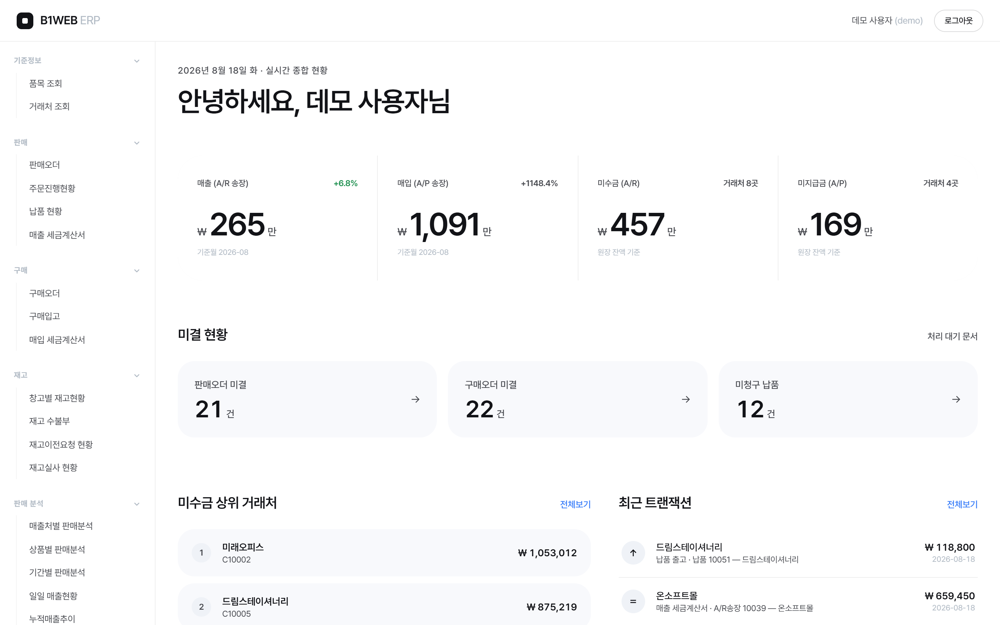
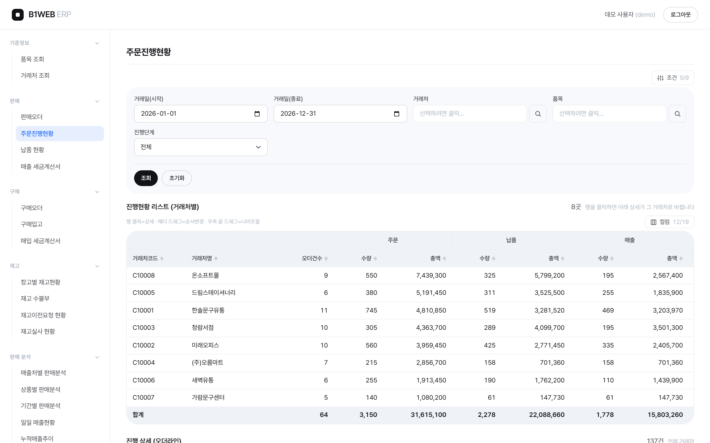
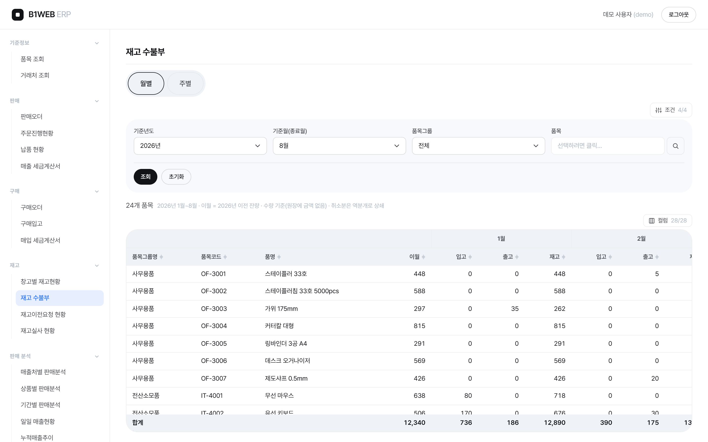
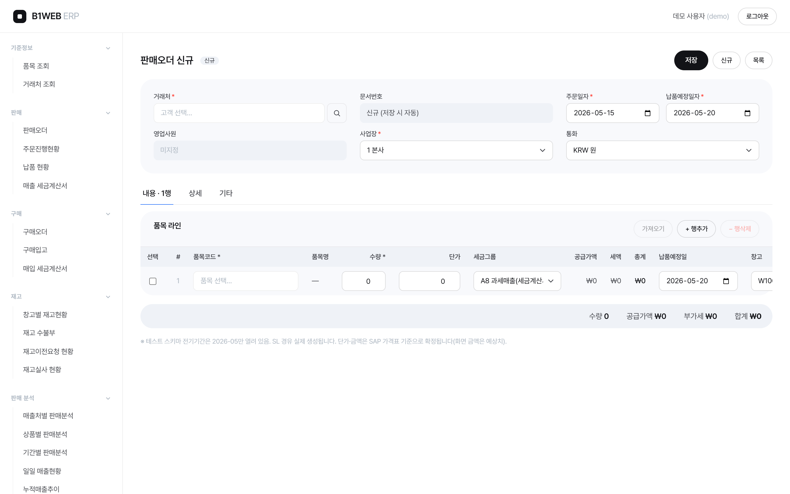

# B1WEB-Next — SAP B1 기반 웹 ERP를 Next.js로 재구축

> 사내에서 운영하던 **웹 ERP(Spring MVC + JSP, SAP Business One HANA 기반)** 를
> Next.js App Router로 재구축한 사이드 프로젝트입니다. 판매·구매 문서흐름(오더 → 납품/입고 →
> 송장), 재고, 마스터, 분석 리포트까지 **ERP의 핵심 도메인을 실제로 동작하는 형태**로 구현했습니다.
>
> **모든 데이터는 가상입니다.** 회사·거래처·품목·인물 어느 것도 실존하지 않으며,
> 실서버(SAP Service Layer·HANA) 접속 정보는 포함되어 있지 않습니다.

## 라이브 데모

### 👉 https://b1web-next.vercel.app

로그인 화면의 **[데모 계정으로 둘러보기]** 버튼이면 바로 들어갑니다 (직접 입력 시 `demo` / `demo1234`).

[](https://b1web-next.vercel.app)

> 서버리스 환경에서는 데모 DB가 메모리에 뜨므로(콜드스타트마다 재시드) 생성·수정한 문서는
> 인스턴스가 살아있는 동안만 유지됩니다. 쓰기 흐름 전체를 보시려면 로컬 실행을 권장합니다.

## 실행

```bash
npm install
npm run dev        # http://localhost:3000
```

외부 DB·환경변수·계정 설정이 필요 없습니다. 첫 실행 때 SQLite 데모 DB(`.data/b1web.db`)가
자동 생성되고, 가상 ERP 데이터(문서 200여 건 + 마스터)가 시드됩니다.

로그인: **`demo` / `demo1234`**

```bash
npm run verify     # lint → typecheck → smoke (완료 판정 기준)
npm run smoke      # 데모 ERP 스모크 — 읽기가드·문서흐름 왕복·재고 정합·수불부 대사
npm run db:reset   # 데모 DB 삭제 → 다음 실행 때 재시드
npm run shots      # README 스크린샷 재생성 (설치된 Chrome/Edge 사용, dev 서버 필요)
```

## 무엇을 보여주는 프로젝트인가

| 주제 | 내용 |
|---|---|
| **ERP 문서흐름** | 오더 → 납품/입고 → 송장의 **문서연결(draw)** 을 실제로 구현. 부분 이월 시 미결수량(OpenQty) 차감, 전량 이월 시 라인·문서 마감, 취소 시 복원까지 동작 |
| **업무규칙 강제** | 미결수량 초과 이월 거부, 후속문서 있는 문서의 취소 거부, 이월된 수량 축소 거부 — 위반은 화면에 그대로 노출 |
| **재고 정합** | 납품/입고가 재고원장(OINM)과 창고별 재고(OITW)를 갱신하고, 열린 오더에서 약정·발주잔량을 재계산 |
| **읽기/쓰기 경계 분리** | 조회는 read-only 게이트웨이(SELECT/WITH/CALL만 허용, 다중문·DML 기계적 차단), 쓰기는 ERP 엔진 한 통로 |
| **보안 기본기** | 조회 프로시저는 서버측 화이트리스트로만 호출, 세션은 비밀번호를 담지 않는 HMAC 서명 쿠키(httpOnly · 만료) |
| **공통 조회 프레임워크** | 문서 6종이 같은 검색·그리드·컬럼선택·합계 바를 공유. 화면 추가는 템플릿 복제 |

## 아키텍처

```
브라우저 (Next.js 16 App Router · React 19)
    │  Server Component 가 데이터 계층을 직접 호출
    ├─ 조회 ─→ src/lib/db/hana.ts   (read-only 게이트웨이)
    │            └ src/lib/db/sqlite.ts — HANA 호환 계층
    └─ 쓰기 ─→ src/lib/sl/documents.ts (문서 계약)
                 └ src/lib/sl/localErp.ts — ERP 엔진
                          ▼
                 SQLite (better-sqlite3) + 가상 시드
```

**HANA 호환 계층이 이 프로젝트의 전환 핵심입니다.** 원본은 SAP HANA에 직접 질의했고
화면 30여 개가 HANA 문법(`SELECT TOP`·`TO_VARCHAR`·`TO_DECIMAL`·`DAYS_BETWEEN`)을 씁니다.
어댑터에 커스텀 SQL 함수를 등록하고 `TOP`을 재작성해 **화면 쿼리를 한 줄도 고치지 않고**
DB만 교체했습니다. 저장 프로시저(`CF_W5000`)는 결과셋 계약을 그대로 지키는 TS 구현으로 대체했습니다.

## 화면

### 주문진행현황 — 오더 → 납품 → 송장 파이프라인
거래처별로 3단계를 나란히 놓고, 행을 클릭하면 아래에 그 거래처의 오더라인이 펼쳐집니다.
진행률·미납·미청구·납기경과를 라인 단위로 판정합니다.



### 재고 수불부 — 월별/주별 피벗
기준월까지 월별로 (입고·출고·재고)가 동적으로 확장되는 피벗. 2단 그룹헤더·좌측 고정열·합계행을
공통 그리드(`DataGrid`)가 처리합니다. **기말재고 = 창고별 재고(OITW) 합**이 테스트로 고정돼 있습니다.



### 판매오더 입력 — 쓰기는 ERP 엔진 경유
화면·액션은 표준 테이블에 직접 쓰지 않습니다. 문서연결·미결수량·재고원장·분개·취소 복원이
엔진 한 곳(`src/lib/sl/`)에 모여 있습니다.



<details>
<summary>화면 목록 (전체)</summary>


- **대시보드** — 매출·매입 KPI, 채권/채무, 미결 문서, 최근 분개
- **문서 6종** — 판매오더 / 납품 / A/R송장 / 구매오더 / 입고 / A/P송장 (목록·상세·생성·수정·취소·문서연결)
- **마스터** — 품목, 거래처 (목록·상세·창고별 재고·이동이력)
- **분석 리포트 W3040~W3100** — 매출처별·상품별·기간별·일일·누적 추이
- **주문진행현황 W3071** — 오더→납품→송장 3단계 병렬 집계(거래처별) + 오더라인 진행 상세(진행률·미납·납기경과)
- **재고 W3130 / W5030 / W5060 / W5070 / W5071** — 창고별 재고, 재고이전요청, 재고전기리스트, 재고 수불부(월별·주별 피벗)

</details>

## 스택

Next.js 16 · React 19 · TypeScript strict · Tailwind 4 · TanStack Table ·
better-sqlite3 · bcryptjs(HMAC 세션) · GitHub Actions CI

## 배포 · CI/CD

- **CI** (GitHub Actions): push/PR 마다 `verify`(lint·typecheck·스모크 27항목) → `build`
- **CD** (Vercel Git 연동): `main` push → 프로덕션 배포, PR → 프리뷰 URL 자동 발급
- **로컬 실행에 필요한 환경변수는 없다.** 서버리스에서는 콜드스타트 때 메모리 DB에
  시드를 즉석 생성한다(`src/lib/db/sqlite.ts`).
- ⚠️ **공개 배포 시 `AUTH_SECRET` 은 설정한다** — 미설정이면 세션 서명에 저장소에
  공개된 기본 키를 쓰므로 쿠키 위조가 가능하다. 데모 데이터뿐이라 얻을 것은 없지만,
  로그인 화면을 우회할 수 있으니 배포 환경에는 32바이트 랜덤값을 넣는다.
- **서버리스는 데이터가 영속되지 않는다** — 인스턴스별 독립 `:memory:` DB라 데모에서
  만든 문서는 인스턴스 수명만큼만 유지된다 (`docs/decisions/ADR-0001` 트레이드오프).

### 의존성을 바꿨다면

```bash
npm run lock:fix   # Windows npm 이 lock 에서 지우는 @emnapi 항목 복원 — 안 하면 Linux CI 실패
```

`.claude/hooks/sync-lock-after-npm.sh` 가 npm 명령 직후 자동으로 돌지만, 수동으로도 돌릴 수 있다.
